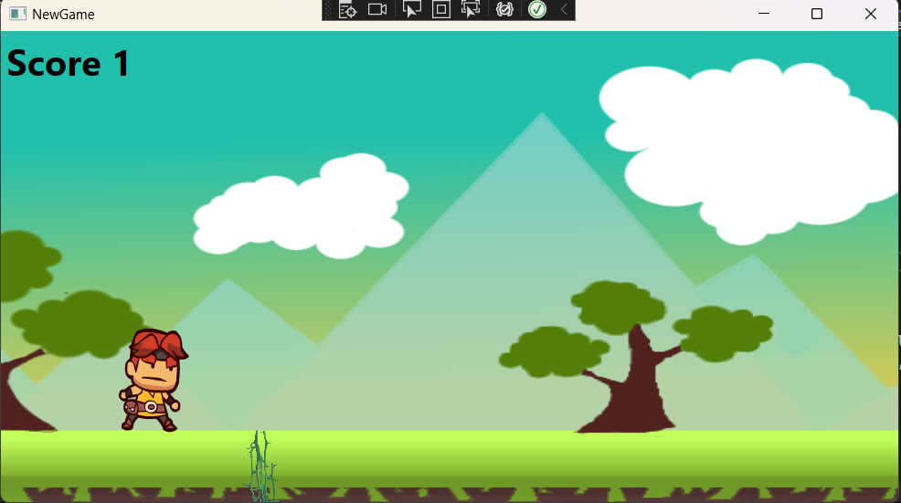

# README.md

This is the first attempt to build side scrolling game using WPF where XAML is a frontend language and C# is a backend languages.

Player images from [here](https://www.pngwing.com/en/free-png-ptkmz/download).

Obstacle image from [here](https://www.pngwing.com/en/free-png-yjpos/download).

Background was made using Krita.

## Screenshots

## Authors

- [@Yasya12](https://github.com/Yasya12)

